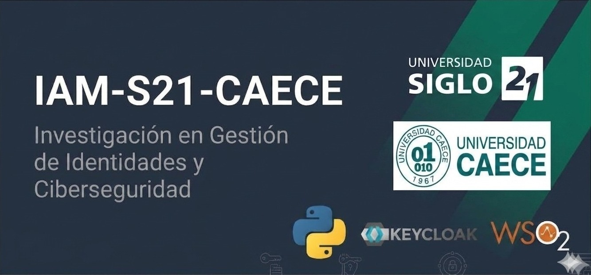

  

# Proyecto Interuniversitario IAM-S21-CAECE
Investigación conjunta entre la **Universidad Siglo 21** y la **Universidad CAECE** sobre Gestión de Identidad y Acceso (IAM) hacia la Web 3.0, arquitecturas híbridas (Keycloak / WSO2), pruebas read team y agentes inteligentes defensivos/ofensivos en Python.
